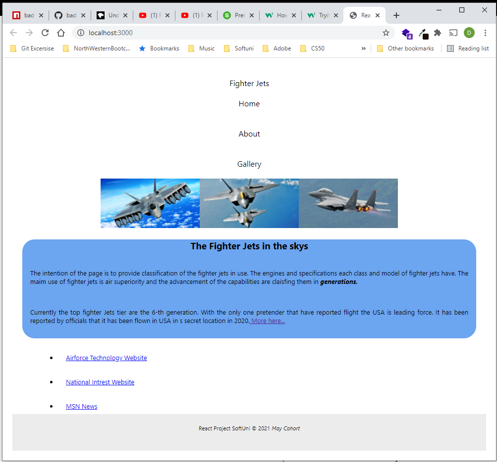

##### Getting Started with Create React App

This project was bootstrapped with [Create React App](https://github.com/facebook/create-react-app).
In the project directory, you can run:
##### `yarn start`    Open [http://localhost:3000](http://localhost:3000) to view it in the browser.

`Project-1` will have
  - login
  - dispatcher board
  - links to google maps
  - data tables with loads
  - profiles
  - average prices

`Project-2` Create website for fighter jets. 
concept:
pages with pictures of different jets 
statistics about :
### 1. Production -some statistics from wikipedia
### 2. Employment into the armies of the world -US, Russia,Israel, China,France, Greace, India
### 3. Table with the specifications of the jets - twin engines, single engines, speed, distance
### 4. Blog part of the site with - 3-4 articles 300 words
#### 4.1. Comment section
#### 4.2. Like buttons
#### 4.3. Views of the page. Count each time the page is loaded in intervals of 5 minutes

Used site for flavicon convertion https://www.icoconverter.com/
 ##### SCREENSHOT 
 